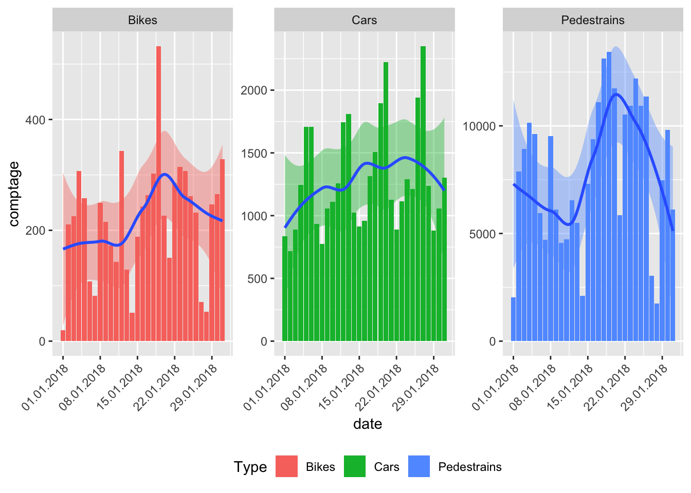

<!-- README.md is generated from README.Rmd. Please edit that file -->
EcoCounteR - An R API wrapper for the EcoCounter project
========================================================

[](https://travis-ci.org/JohannesFriedrich/EcoCounteR) [](https://ci.appveyor.com/project/JohannesFriedrich/ecocounter) [](http://www.repostatus.org/#active)

Installation
------------

Until now the package is not on CRAN but you can download it via GitHub with the following command:

``` r
if (!require("devtools"))
  install.packages("devtools")
devtools::install_github("JohannesFriedrich/EcoCounteR")
```

Introduction
------------

The **R**-package *EcoCounteR* is an API wrapper for data collected by <https://www.eco-compteur.com>. You can request available data from different Eco Counter installations by submitting the Id of the installation to different functions:

<table style="width:100%;">
<colgroup>
<col width="25%" />
<col width="64%" />
<col width="9%" />
</colgroup>
<thead>
<tr class="header">
<th>Function name</th>
<th>Description</th>
<th>Example</th>
</tr>
</thead>
<tbody>
<tr class="odd">
<td>get_EcoCounter_info()</td>
<td>request common information about an installation</td>
<td>get_EcoCounter_info(100020207)</td>
</tr>
<tr class="even">
<td>get_EcoCounter_location()</td>
<td>request location of an installation</td>
<td>get_EcoCounter_location(100020207)</td>
</tr>
<tr class="odd">
<td>get_EcoCounter_data()</td>
<td>request data from an installation</td>
<td>get_EcoCounter_data(101020207)</td>
</tr>
</tbody>
</table>

The following chapters show some examples how to use the **R**-package *EcoCounteR*.

Request basic information from Eco Counter API <a id="basic_information"></a>
-----------------------------------------------------------------------------

First we load some needed packages. The function `get_EcoCounter_info()` will deliver some information about an installation located at Calgary in the Stephen Avenue. The only argument in `get_EcoCounter_info()` is the Id of the installation.

``` r
library(EcoCounteR)
library(leaflet)
library(htmltools)

EcoCounterId <- 100020207
info <- get_EcoCounter_info(EcoCounterId)
```

``` r
info
```

<table>
<thead>
<tr>
<th style="text-align:right;">
id
</th>
<th style="text-align:left;">
name
</th>
<th style="text-align:left;">
nameId
</th>
</tr>
</thead>
<tbody>
<tr>
<td style="text-align:right;">
101020207
</td>
<td style="text-align:left;">
Stephen Avenue Pedestrian Counts
</td>
<td style="text-align:left;">
Z\_101020207
</td>
</tr>
<tr>
<td style="text-align:right;">
102020207
</td>
<td style="text-align:left;">
Stephen Avenue Cyclist Counts
</td>
<td style="text-align:left;">
Z\_102020207
</td>
</tr>
<tr>
<td style="text-align:right;">
103020207
</td>
<td style="text-align:left;">
Stephen Avenue Car Counts
</td>
<td style="text-align:left;">
Z\_103020207
</td>
</tr>
</tbody>
</table>
For later requests we need the coloumn `id` to get data from this specific installation.

The function `get_EcoCounter_info()` can also handle multiple EcoCounterIds, e.g.:

``` r
EcoCounterIds <- c(100020207, 100017181)

info <- get_EcoCounter_info(EcoCounterIds)
```

``` r
info
```

<table>
<thead>
<tr>
<th style="text-align:right;">
id
</th>
<th style="text-align:left;">
name
</th>
<th style="text-align:left;">
nameId
</th>
</tr>
</thead>
<tbody>
<tr>
<td style="text-align:right;">
101020207
</td>
<td style="text-align:left;">
Stephen Avenue Pedestrian Counts
</td>
<td style="text-align:left;">
Z\_101020207
</td>
</tr>
<tr>
<td style="text-align:right;">
102020207
</td>
<td style="text-align:left;">
Stephen Avenue Cyclist Counts
</td>
<td style="text-align:left;">
Z\_102020207
</td>
</tr>
<tr>
<td style="text-align:right;">
103020207
</td>
<td style="text-align:left;">
Stephen Avenue Car Counts
</td>
<td style="text-align:left;">
Z\_103020207
</td>
</tr>
<tr>
<td style="text-align:right;">
101017181
</td>
<td style="text-align:left;">
7 Street South of 3 Ave SW\_SB
</td>
<td style="text-align:left;">
Z\_IN\_101017181
</td>
</tr>
<tr>
<td style="text-align:right;">
102017181
</td>
<td style="text-align:left;">
7 Street South of 3 Ave SW\_NB
</td>
<td style="text-align:left;">
Z\_OUT\_102017181
</td>
</tr>
</tbody>
</table>
Map location of an installation
-------------------------------

To get an overview of the installations, we can use the function `get_EcoCounter_location()`. This function extracts the coordinates from the installations. We can insert the result directly to the **R**-package `leaflet`.

``` r
get_EcoCounter_location(EcoCounterId) %>% 
leaflet() %>%
  addProviderTiles(providers$OpenStreetMap) %>% 
  addTiles() %>%  
  addMarkers(~long, ~lat, popup = ~htmltools::htmlEscape(name))
```


Request data from Eco Counter API
---------------------------------

Now we can use the extracted information to request data. First we load some packages which help to analyse and visualise data.

``` r
library(dplyr)
library(ggplot2)
library(scales)
```

From section [2](#basic_information) we know different sub-Ids of an installation. We allocate the different sub-Ids:

``` r
Stephan_Avenue_Ped <- 101020207
Stephan_Avenue_Bike <- 102020207
Stephan_Avenue_Car <- 103020207
```

Now it's time to request some data. For that purpose the function `get_EcoCounter_data()` can be used. The function takes just one required argument: EcoCounterId. **Note: This is not the same EcoCounterId as inserted in `get_EcoCounter_data()`and `get_EcoCounter_location()`**. The function `get_EcoCounter_data()` can take more arguments to specify the request.

<table>
<colgroup>
<col width="40%" />
<col width="36%" />
<col width="23%" />
</colgroup>
<thead>
<tr class="header">
<th>Argument</th>
<th>Description</th>
<th>Example</th>
</tr>
</thead>
<tbody>
<tr class="odd">
<td>EcoCounterId</td>
<td>sub-Id to request specific installation</td>
<td>101020207</td>
</tr>
<tr class="even">
<td>from</td>
<td>Start date of the requested data in the form &quot;YYYYMMDD&quot;</td>
<td>&quot;20180101&quot;</td>
</tr>
<tr class="odd">
<td>to</td>
<td>End date of the requested data in the form &quot;YYYYMMDD&quot;</td>
<td>&quot;20180110&quot;</td>
</tr>
<tr class="even">
<td>step</td>
<td>Frequency of saved data: 2 (15 min), 3 (hourly), 4 (daily), 5 (weekly), 6 (monthly), 7 (yearly)</td>
<td>step = 3</td>
</tr>
</tbody>
</table>

Some examples:

``` r
## get daily saved data for the day before yesterday and yesterday
get_EcoCounter_data(101020207)

## get daily saved data from 1st January 2018 until yesterday 
get_EcoCounter_data(101020207, from = "20180101")

## get hourly saved data from 1st January 2018 to 31st January 2018 
get_EcoCounter_data(101020207, from = "20180101", to = "20180131", step = 3)
```

Now let's put things into practical terms. We request data from 1st to 20th January 2018. With `mutate(Type = XXX)` we add a new coloum to the data.frame with the specific type of request.

``` r
Stephan_Avenue_Ped_daily <- get_EcoCounter_data(Stephan_Avenue_Ped, from = "20180101", to = "20180131") %>% 
  mutate(Type = "Pedestrains")

Stephan_Avenue_Bike_daily <- get_EcoCounter_data(Stephan_Avenue_Bike, from = "20180101", to = "20180131") %>% 
  mutate(Type = "Bikes")

Stephan_Avenue_Car_daily <- get_EcoCounter_data(Stephan_Avenue_Car, from = "20180101", to = "20180131") %>% 
  mutate(Type = "Cars")

Stephen_Avenue_complete <- bind_rows(Stephan_Avenue_Ped_daily, Stephan_Avenue_Bike_daily, Stephan_Avenue_Car_daily)
```

In the last line all single data.frames are combined to a single data.frame. You can further analyse this data to your own needs, e.g. find the days with the most appearance per type:

``` r
Stephen_Avenue_complete %>% 
  group_by(Type) %>% 
  top_n(1, comptage)
## # A tibble: 3 x 4
## # Groups:   Type [3]
##   date                comptage        id Type       
##   <dttm>                 <int>     <dbl> <chr>      
## 1 2018-01-19 00:00:00    13436 101020207 Pedestrains
## 2 2018-01-19 00:00:00      532 102020207 Bikes      
## 3 2018-01-27 00:00:00     2349 103020207 Cars
```

Visualise Data
--------------

The following examples shows the visualisation of the data.

``` r
g <- ggplot(Stephen_Avenue_complete, aes(x = date, y = comptage, fill = Type)) +
  geom_bar(stat = "identity") +
  scale_x_datetime(labels = date_format("%d.%m.%Y")) +
  theme(legend.position = "bottom",
        axis.text.x = element_text(angle = 45, hjust = 1))

plot(g)
```


``` r

g2 <- g +
  facet_wrap(~Type, scales = "free_y") +
  geom_smooth(show.legend = FALSE)

plot(g2)
```



A more comprehensive visualisation
----------------------------------

We load all available data with the best resolution (every 15 min: `step = 2`). Afterwars an animated heatmap is created with the **R**-package [gganimate](https://github.com/dgrtwo/gganimate). Here you see the code for creating such plots. Note that saving/displaying the results can take longt time. I prefer to render as `mp4`, but for this README a `gif` file was created.

``` r
Stephan_Avenue_Ped_daily <- get_EcoCounter_data(Stephan_Avenue_Ped, 
                                                from = "20141023", 
                                                to = "20180131", 
                                                step = 2) %>% 
  mutate(weekday = wday(date, label = TRUE),
         week = week(date),
         day = day(date),
         monthweek = ceiling(day(date) / 7),
         month = month(date, label = TRUE),
         year = year(date),
         hour = hour(date),
         minute = minute(date),
         time = strftime(date, format = "%H:%M")) %>% 
  na.omit()
```

``` r
g <- ggplot(Stephan_Avenue_Ped_daily, aes(monthweek, weekday, fill = comptage, frame = time)) + 
  geom_tile(colour = "white") + 
  facet_grid(year~month) + 
  scale_fill_gradient(low = "yellow", high = "red") +
  labs(x = "Week of Month",
       y = "Day",
       title = "Pedestrains at Stephan Avenue",
       fill = "Pedestrains")
```

``` r
library(gganimate)

## note: This process can take a long time!
gganimate(g, interval = 0.25, filename = "Pedestrains_Stephan_Avenue.gif")
```


Related projects
----------------
